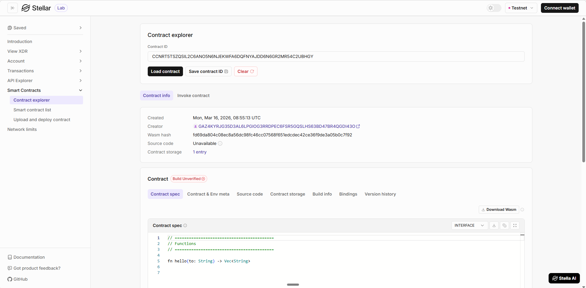

# Soroban Crowdfunding Smart Contract

A simple **crowdfunding smart contract** built using **Rust** for the **Soroban smart contract platform on Stellar**.


This contract allows a campaign creator to set a funding goal and receive contributions from supporters. Once the funding goal is reached, the campaign creator can withdraw the funds.

---

## 📌 Features

* Initialize a crowdfunding campaign
* Contribute funds to the campaign
* Track total funds raised
* Withdraw funds when the funding goal is reached
* Simple and minimal Soroban contract example for learning

---

## 🛠 Tech Stack

* **Rust**
* **Soroban SDK**
* **Stellar Soroban Smart Contracts**
* **WASM**

---

## 📂 Project Structure

```
crowdfunding/
│
├── Cargo.toml
├── README.md
└── src
    └── lib.rs
```

---

## ⚙️ Contract Overview

The smart contract manages a **single crowdfunding campaign**.

The campaign stores:

| Field   | Description                     |
| ------- | ------------------------------- |
| creator | Address of the campaign creator |
| goal    | Target amount to raise          |
| total   | Current amount raised           |

---

## 📜 Contract Functions

### 1️⃣ Initialize Campaign

Creates a new crowdfunding campaign.

**Parameters**

| Parameter | Type    | Description           |
| --------- | ------- | --------------------- |
| creator   | Address | Campaign creator      |
| goal      | i128    | Target funding amount |

Example

```
init(creator, goal)
```

---

### 2️⃣ Contribute

Allows users to contribute funds to the campaign.

**Parameters**

| Parameter | Type    | Description         |
| --------- | ------- | ------------------- |
| from      | Address | Contributor address |
| amount    | i128    | Contribution amount |

Example

```
contribute(from, amount)
```

---

### 3️⃣ Get Total Funds

Returns the total amount raised in the campaign.

Example

```
get_total()
```

---

### 4️⃣ Withdraw Funds

Allows the campaign creator to withdraw funds **only after the funding goal is reached**.

**Parameters**

| Parameter | Type    | Description      |
| --------- | ------- | ---------------- |
| creator   | Address | Campaign creator |

Example

```
withdraw(creator)
```

---

## 🚀 Build the Contract

Install Soroban CLI:

```
cargo install --locked soroban-cli
```

Build the contract:

```
cargo build --target wasm32-unknown-unknown --release
```

The compiled contract will be generated at:

```
target/wasm32-unknown-unknown/release/crowdfunding.wasm
```

---

## 🌐 Deployment

Deploy the contract to the Soroban testnet.

```
soroban contract deploy \
--wasm target/wasm32-unknown-unknown/release/crowdfunding.wasm \
--source <ACCOUNT_NAME> \
--network testnet
```

---

## 📍 Contract Information

After deployment, update the following values.

```
Network: Soroban Testnet

Contract Address:
<YOUR_CONTRACT_ADDRESS_HERE>

Deployer Address:
<YOUR_DEPLOYER_ADDRESS_HERE>
```

Example:

```
Contract Address:
https://lab.stellar.org/r/testnet/contract/CCNRT5TSZQSIL2C6ANO5N6NJEKWFA6DQFNYAJDD6N6GR2MR54C2UBHGY
```


---


## 🔐 Security Notes

This contract is a **basic example** and does not include advanced security features such as:

* refund mechanisms
* campaign deadlines
* token transfers
* multi-campaign support
* contributor tracking

Use this project **for learning purposes**.

---

## 🔮 Future Improvements

Possible upgrades:

* Support for **Stellar tokens**
* Add **campaign deadlines**
* Allow **refunds if funding goal fails**
* Track **contributors**
* Add **events for contributions**
* Support **multiple campaigns**

---

## 📚 Resources

* Stellar Developer Docs
* Soroban SDK Documentation
* Rust Programming Language

---

## 📄 License

MIT License

---
